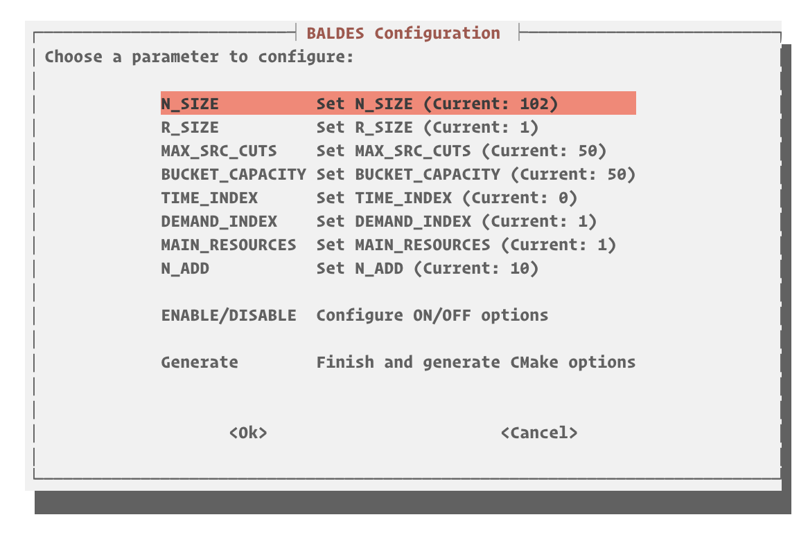

<div align="center">


<br>

  
    
  

</div>
<br>

**BALDES**: A Bucket Graph Labeling Algorithm for Vehicle Routing

<table>
  <tr>
    <td>
      
    </td>
    <td>
      BALDES (pronounced /'baw-dɨs/) is a C++ implementation of a Bucket Graph-based labeling algorithm designed to solve the Resource-Constrained Shortest Path Problem (RSCPP), commonly used as a subproblem in state-of-the-art Branch-Cut-and-Price algorithms for various Vehicle Routing Problems (VRPs).
    </td>
  </tr>
</table>


The algorithm is based on the approach presented in the paper:  
**A Bucket Graph Based Labeling Algorithm for Vehicle Routing** by Sadykov et al.

## 📝 Overview

The Bucket Graph-based labeling algorithm organizes labels into **buckets** based on vertex and resource consumption intervals. This structure reduces the number of dominance checks, making the algorithm highly efficient, particularly in large VRP instances with extensive resource constraints.

### 🚀 Key Features

- **Bucket Graph Organization:** Grouping labels by vertex and resource consumption to minimize dominance checks, using n-dimensional Splay Trees to keep the most acessed buckets easier to reach.
- **Parallel Bi-Directional Labeling:** Supports forward and backward search strategies.
- **Dominance Rules:** Efficient dominance checks using resource-based comparisons and integration of additional criteria from Limited-Memory Subset Row Cuts (SRCs) for enhanced speed.
- **Multi-phase solving:** Out-of-the-box multi-phase solving that begins with heuristics and dynamically guides the algorithm towards an exact solution.
- **Good initial solutions** Utilizes the state-of-the-art HGS-VRPTW algorithm to generate high-quality initial bounds and routes, an extension of the HGS-CVRP method employed by the ORTEC team to win the VRPTW track at the DIMACS Implementation Challenge. We also enchanced the HGS-VRPTW with the concepts proposed in [MDM-HGS-CVRP](https://github.com/marcelorhmaia/MDM-HGS-CVRP/).
- **Improvement Heuristics:** Optional fast improvement heuristics are applied at the end of each labeling phase to enhance label quality.

## ⚠️ Disclaimer

Some features are experimental and subject to ongoing improvements:

- **[experimental]** Knapsack Completion Bounds for Capacity Constraints
- **[experimental]** Bucket Arc Fixing

## 🛠️ Building

### 📋 Prerequisites

- C++23 compliant compiler (tested with GCC 14.* and Clang 19.*)
- [NVIDIA/stdexec](https://github.com/NVIDIA/stdexec) for parallel tasks
- [fmt](https://github.com/fmtlib/fmt) for console output formatting
- [TBB](https://github.com/oneapi-src/oneTBB) for concurrent maps

*Optional*
- [pybind11](https://github.com/pybind/pybind11) for optional python wrapper
- [SuiteSparse](https://github.com/DrTimothyAldenDavis/SuiteSparse) requisite for CHOLMOD when using the IPM stabilization

### ⚙️ Compiling

```bash
cmake -S . -B build -DR_SIZE=1 -DN_SIZE=102 -DSRC=ON -DHGS=5
cd build
make -j$nprocs
```

Make sure the `GUROBI_HOME` environment variable is set.

### 🛠️ Compilation Options

---

**Boolean Options**

| Option                  | Description                            | Default                   |
| ----------------------- | -------------------------------------- | ------------------------- |
| `RIH`                   | Enable improvement heuristics          | OFF                       |
| `RCC`$^2$               | Enable RCC cuts                        | OFF                       |
| `SRC3`$^2$              | Enable classical SRC cuts              | OFF                       |
| `SRC`                   | Enable limited memory SRC cuts         | OFF                       |
| `UNREACHABLE_DOMINANCE` | Enable unreachable dominance           | OFF                       |
| `MCD`                   | Perform MCD on instance capacities     | OFF                       |
| `LIMITED_BUCKETS`       | Limit the capacity of the buckets      | OFF                       |
| `SORTED_LABELS`         | Sort labels on bucket insertion        | OFF                       |
| `STAB`$^3$              | Use dynamic-alpha smooth stabilization | ON                        |
| `IPM`$^3$               | Use interior point stabilization       | OFF                       |
| `TR`                    | Use trust region stabilization         | OFF                       |
| `WITH_PYTHON`           | Enable the python wrapper              | OFF                       |
| `SCHRODINGER`           | Enable schrodinger pool                | OFF                       |
| `PSTEP`                   | Enable PStep compilation                 | OFF                       |
| `GET_TBB`               | Enable TBB compilation                 | OFF (will use system lib) |

**Numerical and Other Definitions**

| Option            | Description                                             | Default |
| ----------------- | ------------------------------------------------------- | ------- |
| `R_SIZE`          | Number of resources                                     | 1       |
| `N_SIZE`$^1$      | Number of customers                                     | 102     |
| `MAX_SRC_CUTS`    | Number of allowed SRC cuts                              | 50      |
| `BUCKET_CAPACITY` | Maximum bucket capacity if `LIMITED_BUCKETS` is enabled | 50      |
| `N_ADD`           | Number of columns to be added for each pricing          | 10      |
| `MAIN_RESOURCES`  | Define the number of main resources                     | 1       |
| `HGS`             | Maximum HGS running time                                | 5       |

**Resource Disposability Definition**

To control how each resource is treated (whether disposable, non-disposable, or binary), it is necessary to define a vector using the `#define RESOURCES_DISPOSABLE` directive. Each position in this vector corresponds to a specific resource and should be assigned a value of `0`, `1`, or `2` to indicate the disposability type:

- **0**: Disposable resource – the resource can be consumed or reset during the routing process.
- **1**: Non-disposable resource – the resource is conserved and cannot be disposed of.
- **2**: Binary resource – the resource toggles between two states (e.g., `0` for off and `1` for on).

```cpp
#define RESOURCES_DISPOSABLE {0, 1, 2, 1}
```

> **Note 1**: Including depot and depot copy (end node).
 
> **Note 2**: Both `SRC` and `SRC3` cannot be enabled simultaneously. Ensure only one is selected.

> **Note 3**: Only one stabilization can be selected.

**TUI**

If you prefer, you can run the configurer tool, which provides a TUI for configuring BALDES.

```sh
./configurer.sh
```




## 📂 Input File Format

The input file should specify the number of jobs, time horizon, vehicle capacities, and other VRP constraints.  
See examples in the `examples/` directory.

### 🚀 Running the Example Algorithm

To run Solomon instances in the `example` folder:

```bash
./vrptw C203.txt
```

### 🐍 Python Wrapper

We also provide a Python wrapper, which can be used to instantiate the bucket graph labeling:

```python
import random

# Now you can import the BALDES module
import baldes

# Define jobs
jobs = [baldes.VRPJob() for _ in range(102)]
num_intervals = 1

# Set random bounds for each job
id = 0
for job in jobs:
    job.lb = [random.randint(0, 9000) for _ in range(num_intervals)]  # Set random lower bounds
    job.ub = [random.randint(lb + 1, 10000) for lb in job.lb]  # Set random upper bounds greater than lb
    job.duration = random.randint(1, 100)  # Set random duration
    job.cost = random.randint(1, 100)  # Set random cost
    job.start_time = random.randint(0, 10000)  # Set random start time
    job.end_time = random.randint(job.start_time, 10000)  # Set random end time greater than start time
    job.demand = random.randint(1, 100)  # Set random demand
    job.consumption = [random.randint(1, 100) for _ in range(num_intervals)]  # Set random consumption
    job.set_location(random.randint(0, 100), random.randint(0, 100))  # Set random location
    job.id = id
    id += 1

# Create fake distance matrix with size equal to the number of jobs
distances = [[random.randint(1, 100) for _ in range(len(jobs))] for _ in range(len(jobs))]

# Initialize BucketGraph using these jobs
bg = baldes.BucketGraph(jobs, 12000, 1)

# Create random duals with size equal to the number of jobs
duals = [random.random() for _ in range(len(jobs))]

# Set the distance matrix, adjacency list, and duals
bg.set_distance_matrix(distances)
bg.set_adjacency_list()
bg.set_duals(duals)
bg.setup()

# Call the solve method
labels = bg.solve()
```

## 📜 License

This project is licensed under the MIT License - see the [LICENSE](LICENSE) file for details.

## 🖊️ Cite

If you use this library, please cite it as follows:

```
@Misc{BucketGraphLabeling,
 author       = {Laio Oriel Seman and Pedro Munari and Teobaldo Bulhões and Eduardo Camponogara},
 title        = {BALDES: a modern C++ Bucket Graph Labeling Algorithm for Vehicle Routing},
 howpublished = {\url{https://github.com/lseman/baldes}},
 year         = {2024},
 note         = {GitHub repository},
 urldate      = {2024-09-17},
 month        = sep
}
```

## 🙏 Acknowledgements

We want to thank [Vladislav Nepogodin](https://github.com/vnepogodin) for his insights into C++.

## 📚 References

1. **A Bucket Graph Based Labeling Algorithm for Vehicle Routing.** Ruslan Sadykov, Eduardo Uchoa, Artur Alves Pessoa. Transportation Science, 2021. [DOI: 10.1287/trsc.2020.0985](https://doi.org/10.1287/trsc.2020.0985)
2. **Limited memory rank-1 cuts for vehicle routing problems.** Diego Pecin, Artur Pessoa, Marcus Poggi, Eduardo Uchoa, Haroldo Santos. Operations Research Letters 45.3 (2017): 206-209. [DOI: 10.1016/j.orl.2017.02.006](https://doi.org/10.1016/j.orl.2017.02.006)
3. **Hybrid Genetic Search for the Vehicle Routing Problem with Time Windows: a High-Performance Implementation.** Wouter Kool, Joep Olde Juninck, Ernst Roos, Kamiel Cornelissen, Pim Agterberg, Jelke van Hoorn, Thomas Visser. 12th DIMACS Implementation Challenge Workshop, 2022.
4. **Hybrid genetic search for the CVRP: Open-source implementation and SWAP\* neighborhood.** Thibaut Vidal. Computers & Operations Research, 140 (2022): 105643. [DOI: 10.1016/j.cor.2021.105643](https://doi.org/10.1016/j.cor.2021.105643)
