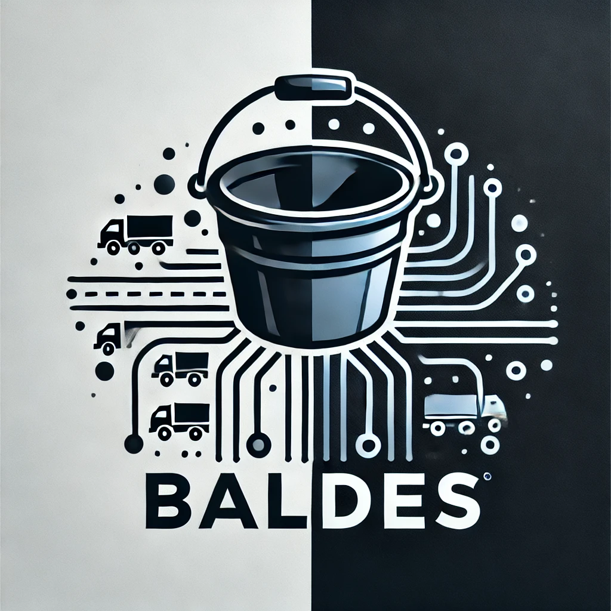
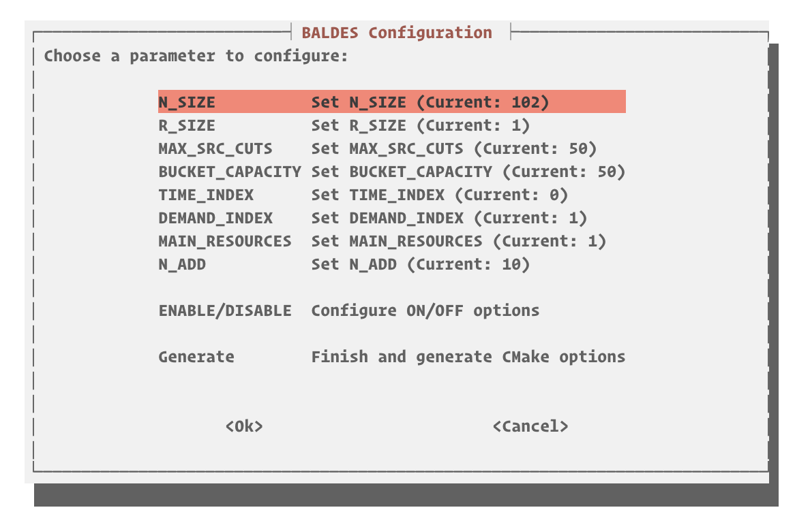
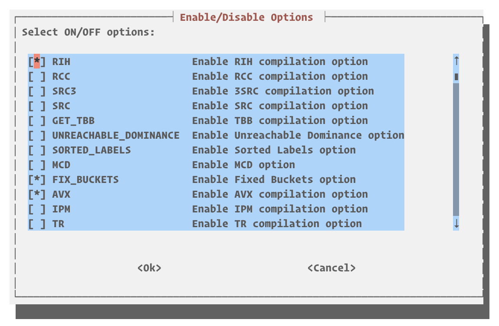

<div align="center">



<br>


</div>

# BALDES

BALDES is a high-performance C++ implementation of a branch-cut-and-price framework for vehicle routing. Its core pricing engine is a bucket-graph labeling algorithm for resource-constrained shortest path problems, with support geared primarily toward CVRP and VRPTW instances.

The project combines bucket-based dominance acceleration with modern VRP machinery such as bidirectional pricing, stabilization, cuts, heuristic warm starts, and branch-and-price components. It is an actively evolving research codebase, so some modules are more mature than others.

## What BALDES focuses on

- Fast pricing for resource-constrained shortest path subproblems.
- Branch-cut-and-price for large-scale vehicle routing models.
- CVRP and VRPTW as the main problem classes.
- Optional extras such as RCC/SRC cuts, heuristic improvement, and Python bindings.

## Quick Start

Build the main solver:

```bash
cmake -S . -B build -DCMAKE_BUILD_TYPE=Release -DBALDES=ON
cmake --build build --parallel
```

Run the bundled examples from the repository root:

```bash
./build/baldes vrptw examples/C203.txt
./build/baldes cvrp examples/XML100_1111_01.vrp
```

Command-line usage:

```text
baldes <problem_kind> <instance_path>
```

Supported `problem_kind` values in the main executable include `vrptw`, `cvrp`, and `evrp`.

## Build Notes

### Requirements

- CMake
- A C++23-capable compiler
- Git, because several dependencies are fetched automatically at configure time via CPM.cmake

Optional components:

- HiGHS for LP/MIP solving support
- Gurobi, if you want the Gurobi backend
- pybind11, if you want Python bindings
- jemalloc, recommended but optional

### Important portability note

The current [CMakeLists.txt](/data/dev/baldes/CMakeLists.txt) pins a local Clang toolchain path:

```cmake
set(CMAKE_CXX_COMPILER "/data/toolchain/llvm/stage2-prof-use-lto/install/bin/clang++" CACHE PATH "C compiler" FORCE)
set(CMAKE_C_COMPILER "/data/toolchain/llvm/stage2-prof-use-lto/install/bin/clang" CACHE PATH "C compiler" FORCE)
```

If those paths do not exist on your machine, edit or remove those lines before configuring.

### Common build configurations

Build the main solver:

```bash
cmake -S . -B build -DCMAKE_BUILD_TYPE=Release -DBALDES=ON
cmake --build build --parallel
```

Build only the standalone HGS executable:

```bash
cmake -S . -B build -DCMAKE_BUILD_TYPE=Release -DHGS=ON -DBALDES=OFF
cmake --build build --parallel
```

Build Python bindings:

```bash
cmake -S . -B build -DCMAKE_BUILD_TYPE=Release -DWITH_PYTHON=ON
cmake --build build --parallel
```

If you enable `GUROBI=ON`, make sure `GUROBI_HOME` is set before configuring.

## Selected CMake Options

The project exposes many compile-time switches. The most useful ones to know up front are:

### Targets and solver backends

| Option | Meaning | Default |
| --- | --- | --- |
| `BALDES` | Build the main `baldes` executable | `OFF` |
| `HGS` | Build the standalone HGS executable | `OFF` |
| `WITH_PYTHON` | Build the `pybaldes` Python module | `OFF` |
| `IPM` | Enable the in-house interior-point solver path | `ON` |
| `HIGHS` | Enable the HiGHS backend | `ON` |
| `GUROBI` | Enable the Gurobi backend | `OFF` |

### Pricing and cut options

| Option | Meaning | Default |
| --- | --- | --- |
| `RCC` | Enable rounded capacity cuts | `ON` |
| `SRC` | Enable subset-row cuts | `ON` |
| `EXACT_RCC` | Enable exact RCC separation | `OFF` |
| `RIH` | Enable improvement heuristics | `OFF` |
| `FIX_BUCKETS` | Enable bucket fixing logic | `ON` |
| `SORTED_LABELS` | Keep labels sorted on insertion | `ON` |
| `UNREACHABLE_DOMINANCE` | Enable unreachable-set dominance support | `OFF` |

### Size and tuning parameters

| Option | Meaning | Default |
| --- | --- | --- |
| `R_SIZE` | Number of resources | `1` |
| `N_SIZE` | Number of nodes | `102` |
| `BUCKET_CAPACITY` | Maximum bucket capacity | `100` |
| `N_ADD` | Number of columns added per pricing round | `10` |
| `HGS_TIME` | HGS time limit | `2` |

For the full list, check [CMakeLists.txt](/data/dev/baldes/CMakeLists.txt).

## Running Instances

The repository ships with small example instances in [examples](/data/dev/baldes/examples).

VRPTW:

```bash
./build/baldes vrptw examples/C203.txt
```

CVRP:

```bash
./build/baldes cvrp examples/XML100_1111_01.vrp
```

## Python Bindings

The Python module is named `pybaldes`.

Build it with:

```bash
cmake -S . -B build -DCMAKE_BUILD_TYPE=Release -DWITH_PYTHON=ON
cmake --build build --parallel
```

Then run one of the example scripts:

```bash
PYTHONPATH=build python examples/python/random_instance.py
```

The Python examples live in [examples/python](/data/dev/baldes/examples/python).

## Configuration Helper

If you prefer a simple text UI for toggling common build flags, run:

```bash
./configurer.sh
```

<p align="center">
  
  
</p>

## Documentation

Doxygen output is published at:

https://lseman.github.io/baldes

## Project Status

BALDES is powerful, but it is still a research-oriented solver. A few things to keep in mind:

- The main focus is CVRP and VRPTW.
- Some modules are experimental, especially around full branch-cut-and-price workflows.
- Build portability could be improved, particularly because of the hardcoded compiler path in the current CMake setup.

## Citation

If you use BALDES in academic work, please cite:

```bibtex
@Misc{BucketGraphLabeling,
  author       = {Laio Oriel Seman and Pedro Munari and Teobaldo Bulh\~oes and Eduardo Camponogara},
  title        = {BALDES: a modern C++ Bucket Graph Labeling Algorithm for Vehicle Routing},
  howpublished = {\url{https://github.com/lseman/baldes}},
  year         = {2024},
  note         = {GitHub repository},
  urldate      = {2024-09-17},
  month        = sep
}
```

## License

This project is licensed under the MIT License. See [LICENSE](/data/dev/baldes/LICENSE).

## Acknowledgements

Thanks to [Vladislav Nepogodin](https://github.com/vnepogodin) for insights into modern C++.

## References

1. Ruslan Sadykov, Eduardo Uchoa, Artur Alves Pessoa. "A Bucket Graph Based Labeling Algorithm for Vehicle Routing." Transportation Science, 2021. https://doi.org/10.1287/trsc.2020.0985
2. Diego Pecin, Artur Pessoa, Marcus Poggi, Eduardo Uchoa, Haroldo Santos. "Limited memory rank-1 cuts for vehicle routing problems." Operations Research Letters 45.3 (2017): 206-209. https://doi.org/10.1016/j.orl.2017.02.006
3. Wouter Kool, Joep Olde Juninck, Ernst Roos, Kamiel Cornelissen, Pim Agterberg, Jelke van Hoorn, Thomas Visser. "Hybrid Genetic Search for the Vehicle Routing Problem with Time Windows: a High-Performance Implementation." DIMACS Implementation Challenge Workshop, 2022.
4. Thibaut Vidal. "Hybrid genetic search for the CVRP: Open-source implementation and SWAP* neighborhood." Computers & Operations Research, 140 (2022): 105643. https://doi.org/10.1016/j.cor.2021.105643
