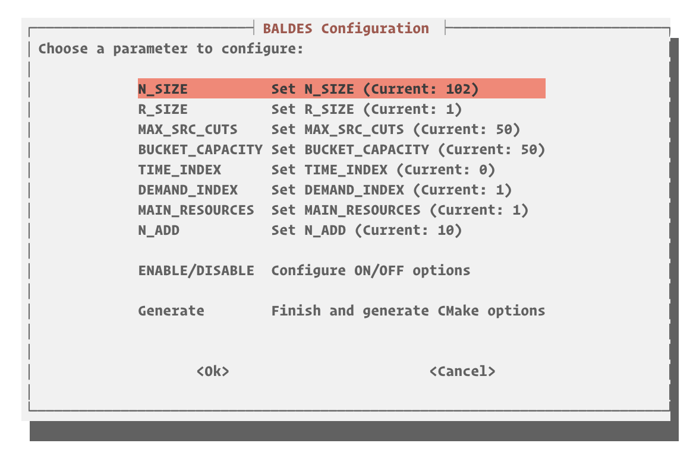
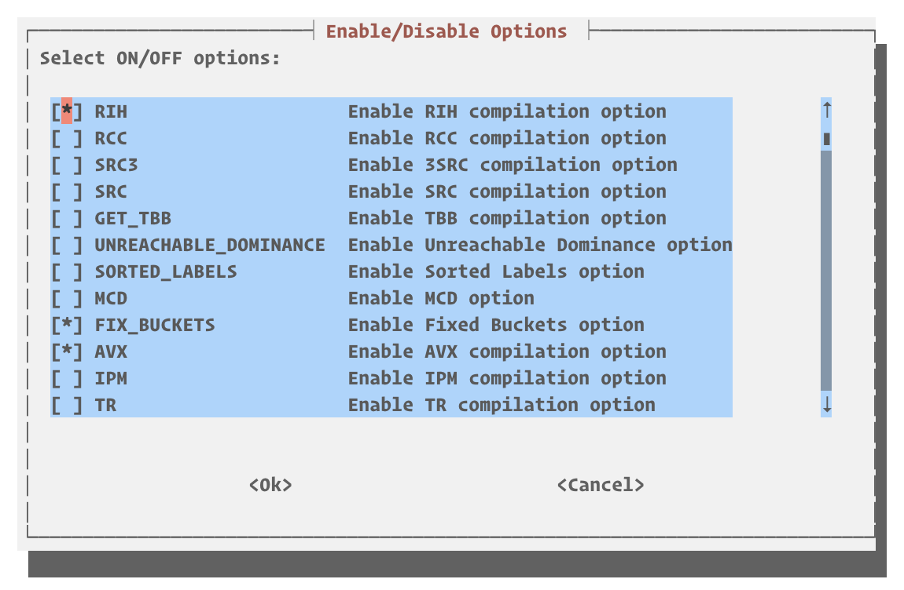

<div align="center">


<br>

  
    
  

</div>
<br>

**BALDES**: A Branch-Cut-and-Price Bucket Graph Labeling Algorithm for Vehicle Routing

<table>
  <tr>
    <td>
      
    </td>
    <td>
      BALDES (pronounced /'baw-dɨs/) is a high-performance C++ implementation of a Branch-Cut-and-Price algorithm. It features a custom version of the Bucket Graph-based labeling algorithm tailored to efficiently solve the Resource-Constrained Shortest Path Problem (RCSPP). Currently, BALDES is optimized for tackling two key problem classes: (i) Capacitated Veichle Routing Problem (CVRP) and (ii) Vehicle Routing Problems with Time-Windows (VRPTW).
    </td>
  </tr>
</table>


The algorithm is based on state-of-the-art RCESPP techniques, including interior point stabilization, limited memory subset row cuts, clustering branching, and the so called bucket graph labelling.

## 📋 Table of Contents
- [📋 Table of Contents](#-table-of-contents)
- [📝 Overview](#-overview)
  - [🚀 Key Features](#-key-features)
- [⚠️ Disclaimer](#️-disclaimer)
- [📋 TODO](#-todo)
- [🛠️ Building](#️-building)
  - [📋 Prerequisites](#-prerequisites)
  - [⚙️ Compiling](#️-compiling)
    - [ macOS users](#-macos-users)
    - [MDM-HGS-VRPTW](#mdm-hgs-vrptw)
  - [🛠️ Compilation Options](#️-compilation-options)
- [📂 Input File Format](#-input-file-format)
  - [🚀 Running the Example Algorithm](#-running-the-example-algorithm)
  - [🐍 Python Wrapper](#-python-wrapper)
- [📖 Documentation](#-documentation)
- [📜 License](#-license)
- [🖊️ Cite](#️-cite)
- [🙏 Acknowledgements](#-acknowledgements)
- [📚 References](#-references)

---

## 📝 Overview

The Bucket Graph-based labeling algorithm organizes labels into **buckets** based on vertex and resource consumption intervals. This structure reduces the number of dominance checks, making the algorithm highly efficient, particularly in large VRP instances with extensive resource constraints.

**Efficient resource-constrained routing:** Scales well for large VRP instances with complex constraints.

**State-of-the-art heuristic integration:** Uses top-performing heuristics from HGS-VRPTW for initial solutions.

**Flexible, customizable configuration:** Optimized for various constraints and resource types.

---
### 🚀 Key Features

- **Bucket Graph Organization**
  
  Grouping labels by vertex and resource consumption to minimize dominance checks, using n-dimensional Splay Trees to keep the most acessed buckets easier to reach.
  
- **Parallel Bi-Directional Labeling**
  
  Supports paralell forward and backward search strategies.

- **Dominance Rules**
  
  Efficient dominance checks using resource-based comparisons and integration of additional criteria from Limited-Memory Subset Row Cuts (SRCs) for enhanced speed. AVX can be enabled for faster dominance check.

- **Multi-phase solving**
  
  Out-of-the-box multi-phase solving that begins with heuristics and dynamically guides the algorithm towards an exact solution.


  - Stage 1: Retain min cost per bucket, filter search space.
  - Stage 2: Relax dominance, expand label retention.
  - Stage 3: Estimate bounds, discard suboptimal paths.
  - Stage 4: Apply exact dominance for optimal path.

- **Limited-Memory Subset Row Cuts**

  Performs the separation of the SRCs in paralell, even for high order cuts.

- **High-quality initial solutions**
  
  Employs the state-of-the-art [HGS-VRPTW](https://github.com/ortec/euro-neurips-vrp-2022-quickstart) algorithm to generate high-quality initial bounds and routes, an extension of the [HGS-CVRP](https://github.com/vidalt/HGS-CVRP) method employed by the ORTEC team to win the VRPTW track at the DIMACS Implementation Challenge. We also enchanced the HGS-VRPTW with the concepts proposed in [MDM-HGS-CVRP](https://github.com/marcelorhmaia/MDM-HGS-CVRP/), resulting in what we call the **MDM-HGS-VRPTW**.

- **Multi-stage branching**
  
  Performs a multi-stage branching, including the recent cluster branching. In each node, **branching variables** are selected through a hierarchical evaluation. The evaluation involves three phases: in **Phase 0**, candidates are chosen based on pseudo-cost history, fractional proximity to integers, and, for edges, distance to the depot. **Phase 1** evaluates these by solving a restricted master LP for each child node without new columns, using the Product Rule to select candidates maximizing lower bound increases. In **Phase 2**, the best candidates undergo further relaxation with heuristic column generation, again selected by the Product Rule. This structured approach adapts to tree depth, prioritizing impactful selections early on.

- **Adaptive Bucket-Size**

  In addition to automatically increasing the bucket step size when the number of dominance checks reach a certain level, we also introduce the concept of "sub-buckets". Sub-buckets are created when the number of labels in a bucket gets to "BUCKET_CAPACITY", and their dominance-order is automatically handled.

- **Improvement Heuristics:** Optional fast improvement heuristics are applied at the end of each labeling phase to enhance label quality. The improvement heuristics are based on an iterated local search with adaptive operators weight in a ANLS-like heuristic.

## ⚠️ Disclaimer

Some features are experimental and subject to ongoing improvements:

- **[experimental]** Branching (Branch-Cut-and-Price) for the CVRP/VRPTW

## 📋 TODO

- [x] Fix branching duals
- [ ] Refactor high order SRC cuts
- [ ] Change pybind to nanobind
- [x] Enchance the improvement heuristics.

## 🛠️ Building

### 📋 Prerequisites

- **C++23 compliant compiler** (tested with GCC 14.* and Clang 19.*)
- **Parallel Tasks:** [NVIDIA/stdexec](https://github.com/NVIDIA/stdexec)
- **Console Output:** [fmt](https://github.com/fmtlib/fmt)
- **Memory Allocation:** [jemalloc](https://jemalloc.net/) (recommended)
- **Hashing and Storage:** [xxHash](https://github.com/Cyan4973/xxHash) and [ankerl::unordered_dense](https://github.com/martinus/unordered_dense)
- **Optional**: [pybind11](https://github.com/pybind/pybind11) for Python wrapper, [Gurobi](https://www.gurobi.com/) for MIP solver

### ⚙️ Compiling

```bash
cmake -S . -B build
cd build
make -j$nprocs
```

Make sure the `GUROBI_HOME` environment variable is set if Gurobi is to be used.

####  macOS users

For macOS, it is recommended to install latest llvm via homebrew.

```bash
brew install llvm
export CC=/opt/homebrew/opt/llvm/bin/clang
export CXX=/opt/homebrew/opt/llvm/bin/clang++
export PATH=/opt/homebrew/opt/llvm/bin:$PATH
```

#### MDM-HGS-VRPTW

To compile only MDM-HGS-VRPTW:

```bash
cmake -S . -B build
cd build
make -j$nprocs -DHGS=ON -DBALDES=OFF
```

### 🛠️ Compilation Options

---


**Boolean Options**

| Option            | Description                            | Default |
| ----------------- | -------------------------------------- | ------- |
| `FIXED_BUCKETS`   | Enable bucket arc fixing               | ON      |
| `JEMALLOC`        | Enable jemalloc                        | ON      |
| `SORTED_LABELS`   | Sort labels on bucket insertion        | ON      |
| `SRC`             | Enable limited memory SRC cuts         | ON      |
| `LIMITED_BUCKETS` | Limit the capacity of the buckets      | OFF     |
| `MCD`             | Perform MCD on instance capacities     | OFF     |
| `RCC`             | Enable RCC cuts                        | OFF     |
| `RIH`             | Enable improvement heuristics          | OFF     |
| `SCHRODINGER`     | Enable schrodinger pool                | OFF     |
| `STAB`$^2$        | Use dynamic-alpha smooth stabilization | OFF     |
| `TR`              | Use trust region stabilization         | OFF     |
| `WITH_PYTHON`     | Enable the python wrapper              | OFF     |


**Solvers**

| Option    | Description                                               | Default |
| --------- | --------------------------------------------------------- | ------- |
| `IPM`$^2$ | Use interior point stabilization with the in-house solver | ON      |
| `HIGHS`   | Enable HiGHS as the IP Solver                             | ON      |
| `GUROBI`  | Enable GUROBI as the IP Solver                            | OFF     |

**Numerical and Other Definitions**

| Option            | Description                                             | Default |
| ----------------- | ------------------------------------------------------- | ------- |
| `R_SIZE`          | Number of resources                                     | 1       |
| `N_SIZE`$^1$      | Number of customers                                     | 102     |
| `BUCKET_CAPACITY` | Maximum bucket capacity if `LIMITED_BUCKETS` is enabled | 50      |
| `N_ADD`           | Number of columns to be added for each pricing          | 10      |
| `HGS`             | Maximum HGS running time                                | 5       |

> **Note 1**: Including depot and depot copy (end node).

> **Note 2**: Only one stabilization can be selected.

**Resource Disposability Definition**

To control how each resource is treated (whether disposable, non-disposable, or binary), define the disposability type for each resource in the `BucketOptions` struct. Each position in the `resource_disposability` vector corresponds to a specific resource and should be assigned a value of `0`, `1`, or `2` to indicate the disposability type:

- **0**: Disposable resource – the resource can be consumed or reset during the routing process.
- **1**: Non-disposable resource – the resource is conserved and cannot be disposed of.
- **2**: Binary resource – the resource toggles between two states (e.g., `0` for off and `1` for on).

Example configuration:

```cpp
struct BucketOptions {
    int depot                   = 0;
    int end_depot               = N_SIZE - 1;
    int max_path_size           = N_SIZE / 2;
    int main_resources          = 1;
    std::vector<std::string> resources = {"time", "capacity"};
    std::vector<int> resource_type = {1, 1}; // 1=disposable, 0=non-disposable
    std::vector<int> or_resources = {1};
};
```

In this example:
- **"time"** is treated as a disposable resource (`0`).
- **"capacity"** is treated as a non-disposable resource (`1`).

**TUI**

If you prefer, you can run the configurer tool, which provides a TUI for configuring BALDES.

```sh
./configurer.sh
```




## 📂 Input File Format

The input file should specify the number of nodes, time horizon, vehicle capacities, and other VRP constraints.  
See examples in the `examples/` directory.

### 🚀 Running the Example Algorithm

To run Solomon-like instances:

```bash
./baldes vrptw ../examples/C203.txt
```

To run CVRP-like instance like the 10k instance proposed by [Uchoa et al.](http://vrp.galgos.inf.puc-rio.br/media/com_vrp/instances/Vrp-Set-XML100.zip).


```bash
./baldes cvrp ../examples/XML100_1111_01.vrp
```


### 🐍 Python Wrapper

We also provide a Python wrapper, which can be used to instantiate the bucket graph labeling:

```python
# Import external libraries
import random

# Now you can import the BALDES module
import pybaldes as baldes

# Define nodes
nodes = [baldes.VRPNode() for _ in range(102)]
num_intervals = 1

# Set random bounds for each node
id = 0
for node in nodes:
    # Set random lower bounds
    node.lb = [random.randint(0, 9000) for _ in range(num_intervals)]  
    # Set random upper bounds greater than lb
    node.ub = [random.randint(lb + 1, 10000) for lb in node.lb]
    # Set random duration
    node.duration = random.randint(1, 100)
    # Set random cost
    node.cost = random.randint(1, 100)
    # Set random start time
    node.start_time = random.randint(0, 10000)
    # Set random end time greater than start time
    node.end_time = random.randint(node.start_time, 10000)
    # Set random demand
    node.demand = random.randint(1, 100)
    # Set random consumption
    node.consumption = [random.randint(1, 100) for _ in range(num_intervals)]
    # Set random location
    node.set_location(random.randint(0, 100), random.randint(0, 100))
    node.id = id
    id += 1

# Create fake distance matrix with size equal to the number of nodes
distances = [[random.randint(1, 100) for _ in range(len(nodes))] for _ in range(len(nodes))]

# Initialize BucketGraph using these nodes
bg = baldes.BucketGraph(nodes, 12000, 1)

# Create random duals with size equal to the number of nodes
duals = [random.random() for _ in range(len(nodes))]

# Set the distance matrix, adjacency list, and duals
bg.set_distance_matrix(distances)
bg.set_adjacency_list()
bg.set_duals(duals)
bg.setup()

# Call the solve method
labels = bg.solve()
```

## 📖 Documentation

You can access the doxygen documentation [here](https://lseman.github.io/baldes).

## 📜 License

This project is licensed under the MIT License - see the [LICENSE](LICENSE) file for details.

## 🖊️ Cite

If you use this library, please cite it as follows:

```
@Misc{BucketGraphLabeling,
 author       = {Laio Oriel Seman and Pedro Munari and Teobaldo Bulhões and Eduardo Camponogara},
 title        = {BALDES: a modern C++ Bucket Graph Labeling Algorithm for Vehicle Routing},
 howpublished = {\url{https://github.com/lseman/baldes}},
 year         = {2024},
 note         = {GitHub repository},
 urldate      = {2024-09-17},
 month        = sep
}
```

## 🙏 Acknowledgements

We want to thank [Vladislav Nepogodin](https://github.com/vnepogodin) for his insights into C++.

## 📚 References

1. **A Bucket Graph Based Labeling Algorithm for Vehicle Routing.** Ruslan Sadykov, Eduardo Uchoa, Artur Alves Pessoa. Transportation Science, 2021. [DOI: 10.1287/trsc.2020.0985](https://doi.org/10.1287/trsc.2020.0985)
2. **Limited memory rank-1 cuts for vehicle routing problems.** Diego Pecin, Artur Pessoa, Marcus Poggi, Eduardo Uchoa, Haroldo Santos. Operations Research Letters 45.3 (2017): 206-209. [DOI: 10.1016/j.orl.2017.02.006](https://doi.org/10.1016/j.orl.2017.02.006)
3. **Hybrid Genetic Search for the Vehicle Routing Problem with Time Windows: a High-Performance Implementation.** Wouter Kool, Joep Olde Juninck, Ernst Roos, Kamiel Cornelissen, Pim Agterberg, Jelke van Hoorn, Thomas Visser. 12th DIMACS Implementation Challenge Workshop, 2022.
4. **Hybrid genetic search for the CVRP: Open-source implementation and SWAP\* neighborhood.** Thibaut Vidal. Computers & Operations Research, 140 (2022): 105643. [DOI: 10.1016/j.cor.2021.105643](https://doi.org/10.1016/j.cor.2021.105643)
